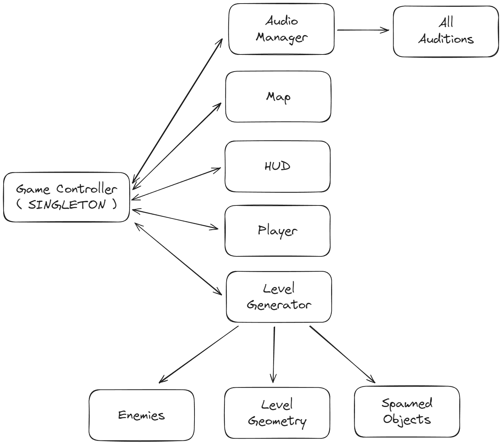

# Game Logic

The general structure of the game can be seen in this picture: 

[GameController](./GameController.cs) is the top level class responsible for interfacing other classes together. It also contains [AudioManager](./AudioManager.cs) that is responsible for playing audios and audible sounds. Audible sounds can be percieved by [Audition](./Enemies/Audition.cs) components. Regarding enemies, [Sight](./Enemies/Sight.cs) enables for percieving the player in a viewcone and rendering the viewcone. Composition of live objects can be seen in this image:

The inheritance of other objects that can be spawned during generation process can be viewed here: 

