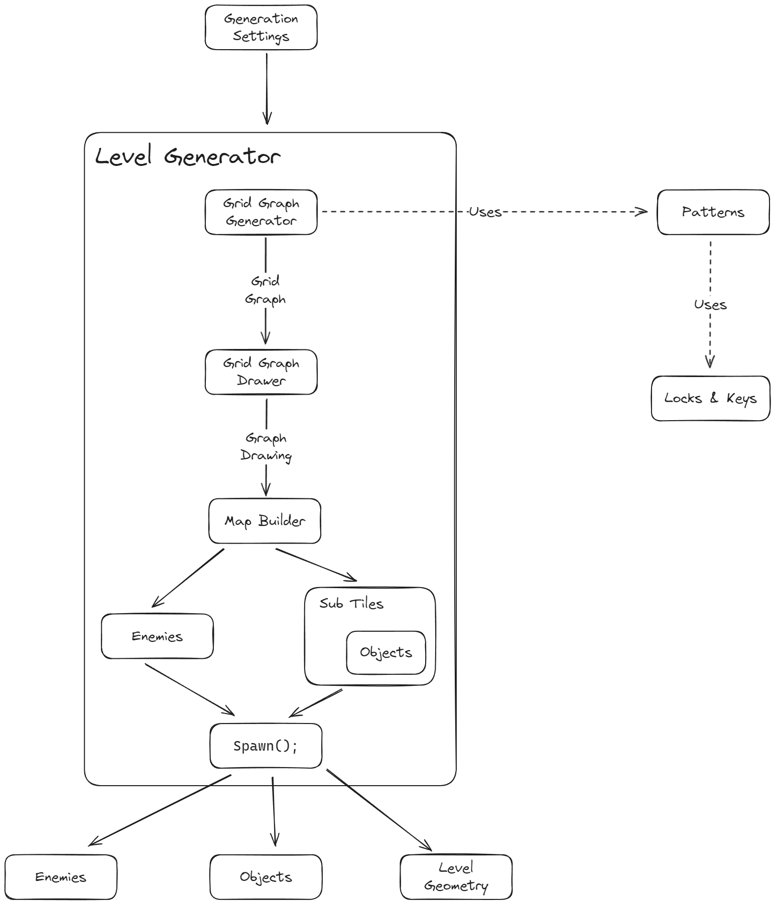

# Level Generation

The level generation is divided into three steps. **Graph Generation**, **Graph Drawing**, and **Map Building**. 

## Graph Generation.

[GridGraphGenerator](./GraphGeneration/GridGraphGenerator.cs) is responsible for this step.
The graph generation is based the cyclic generation algorithm. It begins with a simple graph and applies patterns to it. In our case, we divide the generation into 2 steps. Applying floor patterns for creating new floors, and applying regular patterns on each floor separately.

Patterns are implemented in [GraphGeneration/Pattern.cs](./GraphGeneration/Pattern.cs) file.

Floor Patterns implemented:

Patterns implemented:

## Graph Drawing

[GridGraphDrawer](./GraphDrawing/GraphDrawer.cs) is responsible for this step. It is dependant on the graph generation and more specifically the [GridGraph](./GraphGeneration/GridGraph.cs). The concept behind drawing the graph into a grid is simple: 

The grid graph retains the topological information for this to be possible.

## Map Building

[MapBuilder](./MapBuilding/MapBuilder.cs) is responsible for this step. It creates a Supertile Grid from the graph drawing. Supertile represents a room layout and all supertiles can be found in [MapBuilding/SuperTiles/](./MapBuilding/SuperTiles/). Then, it is deconstructed into [Tiles](./MapBuilding/Tiles/) and finally into [Subtiles](./MapBuilding/SubTiles/).

The following image depicts this process: 

These are the room layouts we implemented: 

