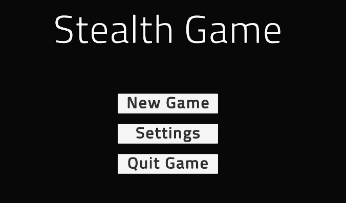
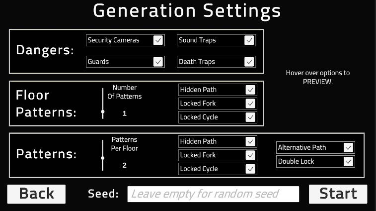
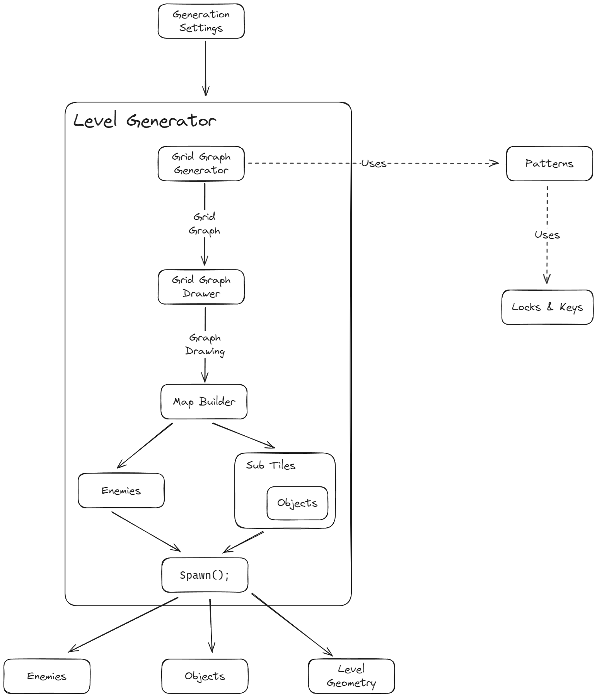

# MasterThesis

This project consists of a small game with generic stealth mechanics and a level generation for it. This project was made in Unity. There are two main parts. The **game** part and the **level generation** part.

To use this project, simply open as any other Unity project, open the `MainMenuScene` and press play. You can install Unity at: https://unity.com/

As for the release, simply unzip and run `.exe` file.

## The Game

When starting the game, press `New Game`, as in the image below.

Then, set generation parameters you desire and press `Start`.

### Controls:

> - **Movement** - W A S D + mouse  
> - **Sprint** - hold Shift  
> - **Slide** - Space while running  
> - **Aim** - Right Mouse Button  
> - **Shoot** - Left Mous Button while aiming  
> - **Use Invisibility Camo** - R  
> - **Peek around corners** - E/Q  
> - **Interact** - F
> - **First Person Camera** - F1  
> - **Top-Down Camera** - F2  
> - **Third Person Camera** - F3  
> - **Open Map** - M  
> - **Move in Map** - W A S D  
> - **Zoom in Map** - Numpad +/-  
> - **Pause/Unpause** - Esc  
> - **Info Screen** - Tab

### Sounds Used:
> - Slide: https://freesound.org/people/pfranzen/sounds/423216/
> - Alternative slide: https://freesound.org/people/PostProdDog/sounds/578492/
> - Glass Shatter: https://freesound.org/people/PNMCarrieRailfan/sounds/682051/
> - Death Grunt: https://freesound.org/people/tonsil5/sounds/416838/
> - Alarm: https://freesound.org/people/onderwish/sounds/470504/
> - Gunshot: https://freesound.org/people/michorvath/sounds/427595/
> - Cut: https://freesound.org/people/SypherZent/sounds/420675/
> - Electric Discharge: https://freesound.org/people/JoelAudio/sounds/136542
> - Doors: https://opengameart.org/content/door-open-door-close-set
> - Beep: https://freesound.org/people/qubodup/sounds/140773/
> - Jingle: https://freesound.org/people/LittleRobotSoundFactory/sounds/270405/
> - Victory: https://freesound.org/people/SilverIllusionist/sounds/462250/
> - Click: https://freesound.org/people/herraportti/sounds/436667/
> - Blick: https://freesound.org/people/Foxfire-/sounds/702168/
> - Steps: https://github.com/goonstation/goonstation/tree/master/sound/misc/step

### Features

> - **Red Traps** - They kill you. Can be disarmed by holding interaction.  
> - **Blue Traps** - Make a lot of sound. Can be disarmed by holding interaction.    
> - **Enemies** - patrol the area, can hear and see you, they kill you if too close and see   
> - **Dark blue ground** - when you stand on such tile, you are hidden from sight  
> - **Security Cameras** - loud noise when they see you, shoot you dead if you remain in their line of sight  
> - **Power Boxes** - Interact to disable cameras (cameras somewhere in other rooms)  and Electronic doors  
> - **Keys + Red Locked Doors** - Walk through a key to pick it up. Then you can open doors to appropriate room. Unfortunately, there is no way of knowing, which key goes to which room.  
> - **Trap Disarming Kits** - Walk through to pick it up. Grants ability to disarm traps instantly.  
> - **Invisibility Camo** - Makes you invisible for a certain duration.

## The Level Generation

The generation itself is based on a cyclic generation algorithm by Short and Admas. While this book provides the basis for an algorithm that exactly generates interconnected levels with lock \& key puzzles, there are a lot of unspecified parts where we needed to complete the design for our purposes. Most notably, extending the concept into 3D space (multiple floors).

### This figure highlights the structure of our level generation algorithm:

